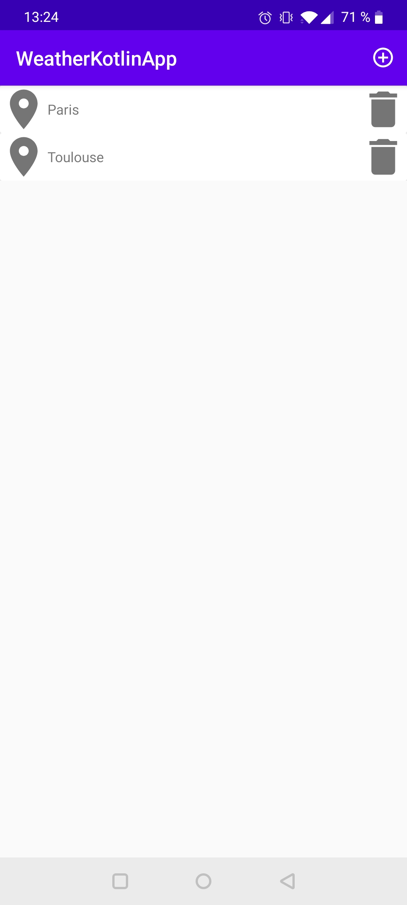
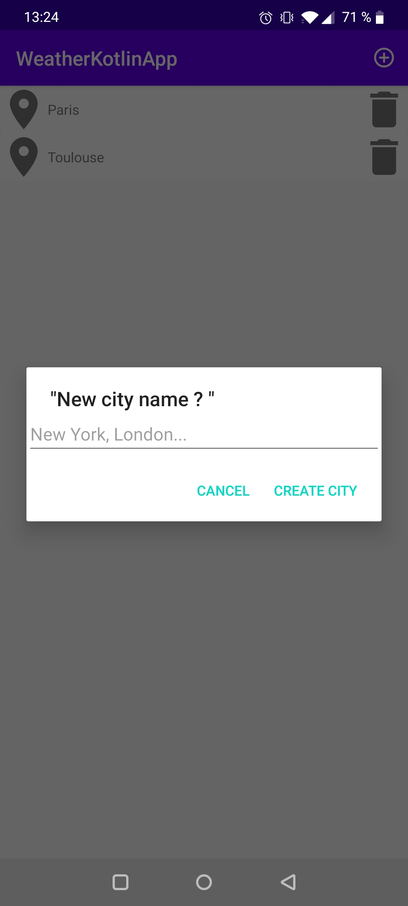
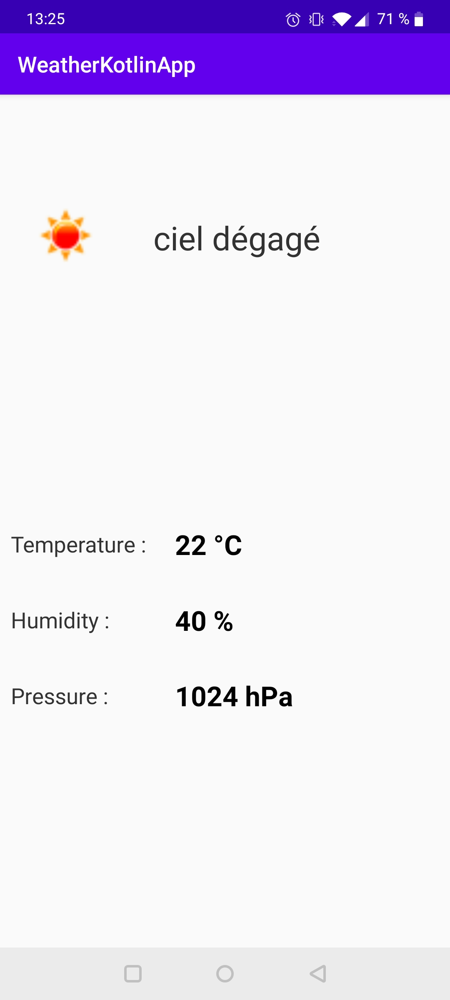

# WeatherKotlinApp

   

## Description

This app is the result of my training in Android and Kotlin at Udemy. Its purpose is to give the weather in different regions or cities in France. The user only has to add the desired city to his list in order to get the weather forecast in this location. The weather data is retrieved by using the OpenWeatherMap API.

## API used

- Kotlin
- Retrofit 2
- OkHttp3
- SwipeRefreshLayout
